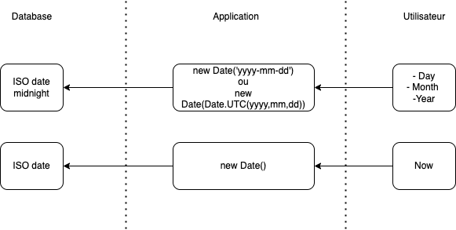

# Keeping consistency in dates

## Importance of keeping consistency

This application uses a lot of dates, so it’s very important to keep consistency. Not doing so may cause the following problems :

- Display a wrong date for the user (for example showing 11/02 instead of 12/02).
- Having multiple rows for the same day in a database that must have only one value per day. For example, for the staffing database, you could have the two following rows (one with 2022-07-10 12:00:00 and another 2022-07-10 10:00:00) and this causes inconsistency of the data.

## Some causes of inconsistency

The following two lines have similar implementations but do not return the same value :

- `new Date('2022-07-5').toISOString()` returns `'2022-07-04T22:00:00.000Z'`
- `new Date('2022-07-05').toISOString()` returns`'2022-07-05T00:00:00.000Z'`
  The same for the following two lines (using `const date = new Date(2022, 6, 2)`)
- `formatISO(date)` returns `2022-07-02T00:00:00+02:00`. `formatISO` comes from the library `date-fns`
- `date.toISOString()` returns `2022-07-01T22:00:00.000Z`

## Some good practices to keep consistency

- When storing dates in the database :

  - If time (by time, I mean hh:mm:ss) is important (usually time is important, if the answer to the question « can I have two values for the same day » is yes), store it with the time in the ISO format.
  - If time is not important, store it in the ISO format in **_GMT midnight_** (FYI, France is GMT+1 or GMT+2 depending on the month). A function `parseGMTMidnight` has been created for this purpose.
    - Always, check in the database that the time is stored as (YYYY-MM-DD 00:00:00).
    - In the mocks, you should set the time at midnight.
  - The following image shows both flows :

    

  - Why do we choose GMT midnight : France sometimes changes the timezone (GMT+1 <-> GMT+2). Using local midnight may cause inconsistency of data with rows using GMT+1 midnight and others using GMT+2 midnight.

- If you are using dates as object keys (object[date]) or if you need to compare dates make you sure you format those dates with the same function. In this project we will use `formatISO` of `date-fns`.
